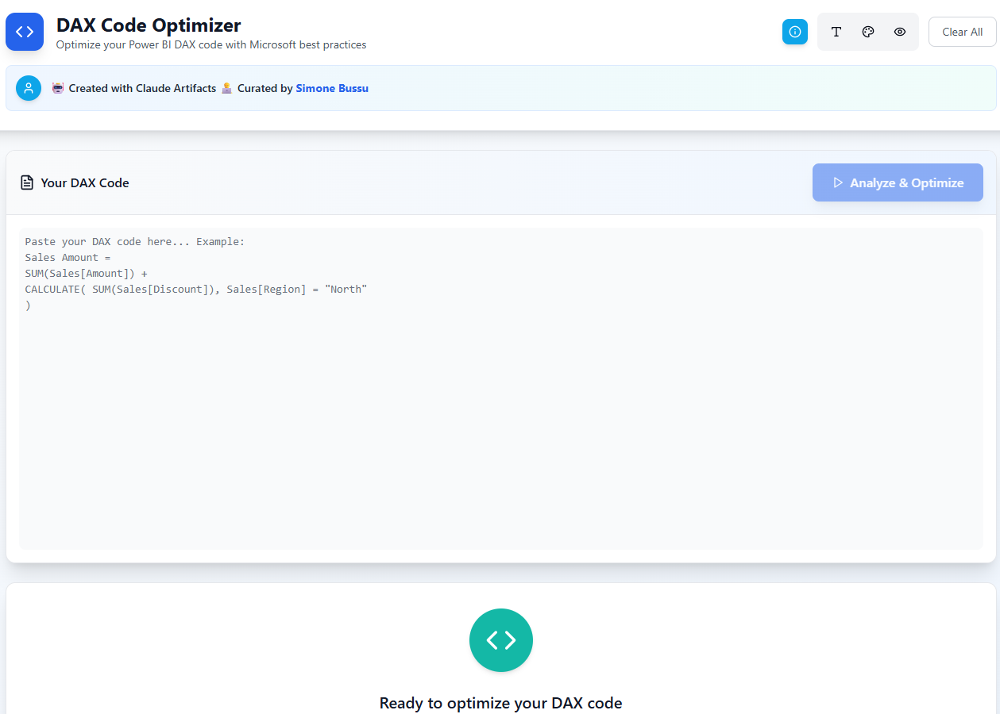

# 🤖AI Artifacts
Repository with AI-powered applications built with [Claude Artifacts](https://www.anthropic.com/news/build-artifacts).
You can find a more detailed description of each artifact in their subfolders.

🧾By using this the artifacts, you agree with the [Anthropic Privacy Policy](https://www.anthropic.com/legal/privacy)

**Caveat**: you need a Claude account to use the artifacts.

## DAX Code Optimizer

This Artifact analyzes your Power BI DAX code and provides optimization suggestions based on Microsoft's official best practices. It helps improve performance, readability, and maintainability of your DAX formulas.
The app provides also an explaination for each chnage made.

**🔗Link:** https://claude.ai/public/artifacts/07a472dd-33c8-4c2b-b8e6-b70d086d7395?fullscreen=true

## 🇫🇷 French Learning Assistant

The Artifact is a language learning companion for those studying French. You can input a text in French, select your mother tongue, the level of formality required by the final text, and Claude will analyze it. As output you will have a corrected text with all the sections highlighted that have been corrected, with an explanation for each of them.

**🔗Link:** https://claude.ai/public/artifacts/93d09d6d-da69-43bc-ad60-07dd9f787e26