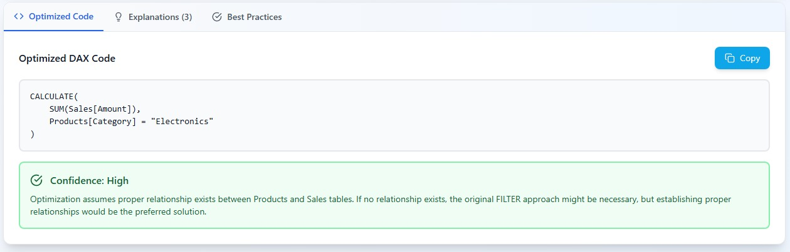
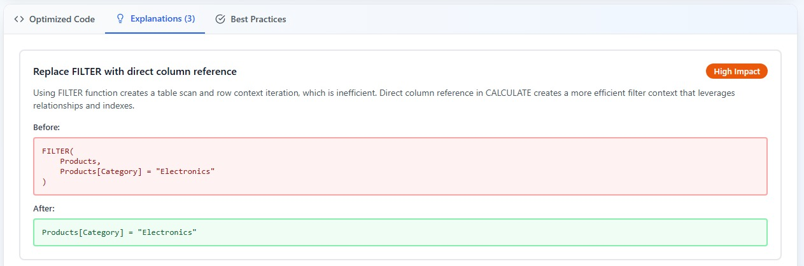
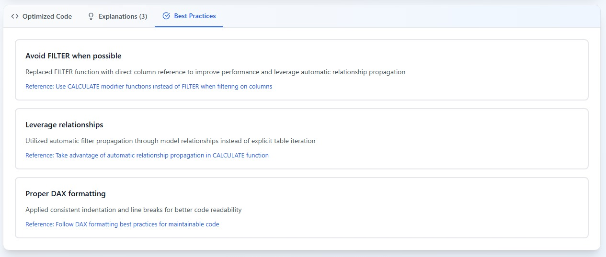

# 🔄 DAX Code Optimizer

This Artifact, made with Claude AI, analyzes your Power BI DAX code and provides optimization suggestions based on Microsoft's official best practices. It helps improve performance, readability, and maintainability of your DAX formulas.

My goal was to build a tool that not only would detect inefficient code, but a tool that would also serve an educational purpose.

**🔗Link:** https://claude.ai/public/artifacts/07a472dd-33c8-4c2b-b8e6-b70d086d7395?fullscreen=true

**Caveat:** You need a Claude Account to use the artifact.

## 🔧 Key Features

1. **Code Analysis:** Reviews your DAX against Microsoft best practices
2. **Code Formatting:** Properly formats your code for better readability
3. **Detailed Explanations:** Explains why each change improves performance
4. **Quality Validation:** Self-checks to minimize incorrect suggestions
5. **Accessibility Options:** Supports dyslexic, colorblind, and high contrast modes

## 📖 How to use:

1. Paste your DAX code in the left panel
2. Click "Analyze & Optimize" to start the analysis
3. Review the optimized code and explanations in the right panel
4. Copy the improved code back to your Power BI model

## 🔒 Privacy & Data Usage

- Your DAX code is sent to Claude AI (by Anthropic) for analysis
- No permanent storage in this app
- Don't share sensitive or proprietary code
- Use responsibly for production environments

By using this tool, you agree with the **Anthropic Privacy Policy**.

## ♿ Accessibility Features:

1. **Dyslexia Mode:** Improves readability with better spacing and fonts
2. **Colorblind Mode:** Uses patterns and grayscale for better accessibility
3. **High Contrast Mode:** Enhanced visibility with bold colors and borders


# Example

Here is an example. Consider the following measure that want to compute the total sales only for the product category "Electronics".

```dax
CALCULATE(
    SUM(Sales[Amount]),
    FILTER(
        Products,
        Products[Category] = "Electronics"
    )
)
```

Paste the code and click on "Analyze & Optimize".

Then in the bottom part of the app, in the "Optimized Code" tab, you will see the reviewed code.


The other tab "Explaination" contains the reasons behind the review.


And finally in the "Best Practice" tab there are the references to the Microsoft documentation.
Always double check as the reference could be incomplete.

