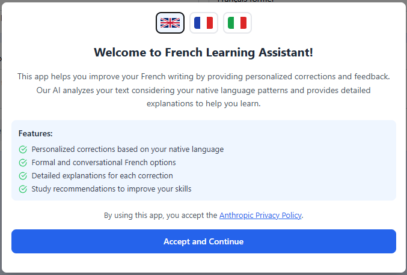
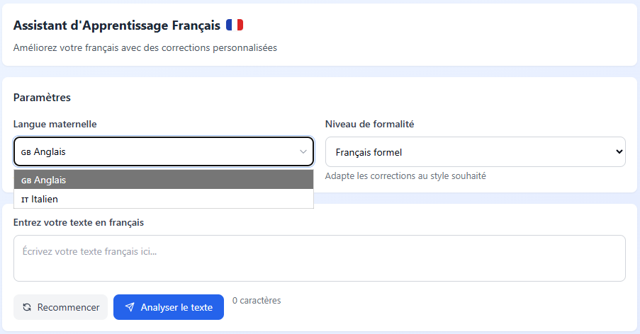
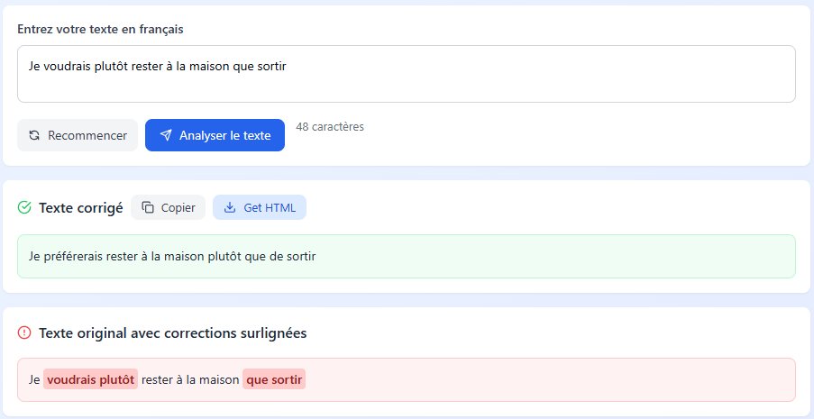
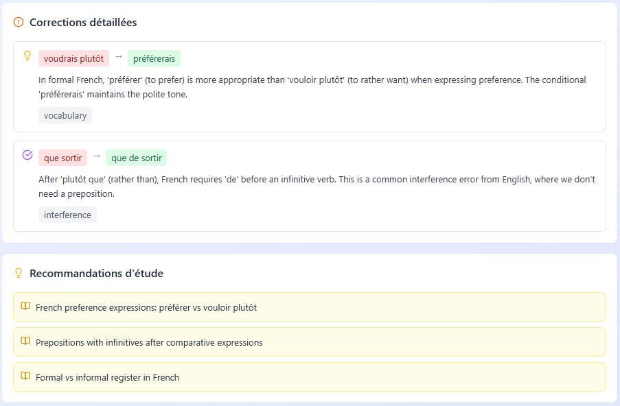

# 🇫🇷 French Learning Assistant

This Artifact, made with Claude AI, analyzes and corrects an input text in French. It provides the corrected version and an explanation for each correction.
You can select your mother tongue, English or Italian, and the level of language formality you need, formal or daily.

My goal was to build a tool that would help people in their French language learning journey.

**🔗Link:** [https://claude.ai/public/artifacts/93d09d6d-da69-43bc-ad60-07dd9f787e26)

**Caveat:** You need a Claude Account to use the artifact.

## ✒️ How to use it

Once you click on the link, you will be redirected to the Artifact and a popup will appear.
You can select the popup's language among English, French and Italian.

Then, you can select in the dropdown list your mother tongue (in this example English / _Anglais_) and the level of formality you want to be applied to the text (in this case Formal / _Français formel_).

Let's try this sentence "_Je voudrais plutôt rester à la maison que sortir_", "I would rather stay home than go out", and then click on "_Analyser le texte_".

As a result, we get the correct sentence and the original one with the typos highlighted.

Scrolling down there is a section with the explanation for each correction and the suggested topics to review.

You can also click on "Get HTML" to download the output as an HTML file. You can find an example in the repository as "fla_html_example".